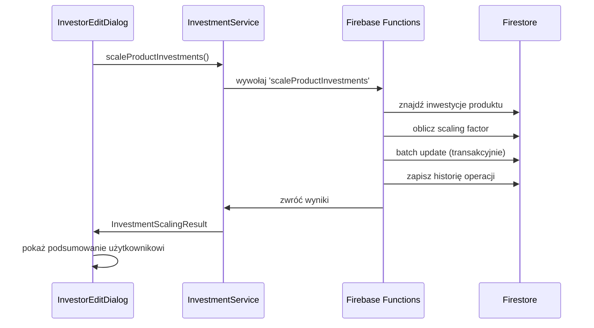

# Migracja Logiki Biznesowej - Skalowanie Inwestycji

## 📋 Podsumowanie Implementacji

Przeniesiono logikę proporcjonalnego skalowania inwestycji z interfejsu użytkownika do architektury backend-first z Firebase Functions.

## 🏗️ Architektura Rozwiązania

### 1. Firebase Functions (Backend)
**Plik**: `functions/services/investment-scaling-service.js`

**Funkcja**: `scaleProductInvestments`
- ⚡ **Transakcyjne aktualizacje** - atomicity operacji
- 🔍 **Inteligentne wyszukiwanie** - po productId, productName, companyId
- 📊 **Proporcjonalne skalowanie** - zachowanie proporcji między inwestorami  
- 📝 **Historia operacji** - automatyczny audit trail
- 🛡️ **Walidacja danych** - bezpieczne przetwarzanie
- 🚨 **Obsługa błędów** - szczegółowe komunikaty

### 2. Flutter Service (Frontend)
**Plik**: `lib/services/investment_service.dart`

**Metoda**: `scaleProductInvestments()`
- 🌐 **Komunikacja z backend** - region europe-west1
- 💾 **Cache management** - automatyczne czyszczenie
- 🎯 **Type-safe modele** - InvestmentScalingResult, Summary, Details
- 🚨 **Rozbudowana obsługa błędów** - user-friendly komunikaty

### 3. UI Integration (Dialog)
**Plik**: `lib/widgets/dialogs/investor_edit_dialog.dart`

**Zmiany**:
- ✅ **Backend-first approach** - skalowanie przez Firebase Functions
- 🎨 **Lepsze UX** - progress indicators i detailed feedback
- 📊 **Szczegółowe podsumowania** - wyniki operacji dla użytkownika

## 🔄 Flow Procesu Skalowania



## 🎯 Korzyści Migracji

### ✅ Bezpieczeństwo i Wydajność
- **Transakcyjność**: Wszystkie aktualizacje w jednej transakcji
- **Atomicity**: Albo wszystkie inwestycje się aktualizują, albo żadna
- **Server-side validation**: Walidacja po stronie serwera
- **Batch operations**: Optymalne operacje bazodanowe

### ✅ Separacja Odpowiedzialności
- **UI**: Prezentacja i user interaction
- **Service**: Komunikacja i cache management
- **Functions**: Business logic i data persistence

### ✅ Audytowalność
- **Historia operacji**: Każde skalowanie zapisywane w `scaling_history`
- **Detailed logging**: Comprehensive server-side logs
- **User tracking**: Kto i kiedy wykonał operację

### ✅ Skalowanie Rozwiązania
- **Multi-tenant ready**: Obsługa różnych firm/produktów
- **Performance**: Server-side bulk operations
- **Reliability**: Firebase Functions auto-scaling

## 🚀 Instrukcja Wdrożenia

### 1. Deploy Firebase Functions
```bash
cd functions
npm install
firebase deploy --only functions:scaleProductInvestments
```

### 2. Test Funkcjonalności
```bash
cd functions
node test_investment_scaling.js
```

### 3. Weryfikacja UI
1. Otwórz Premium Investor Analytics
2. Wybierz inwestora z wieloma inwestycjami
3. Zmień **całkowitą kwotę produktu**
4. Kliknij "Zapisz"
5. Sprawdź czy pojawiły się szczegółowe komunikaty

## 📊 Modele Danych

### InvestmentScalingResult
```dart
class InvestmentScalingResult {
  final bool success;
  final InvestmentScalingSummary summary;  
  final List<InvestmentScalingDetail> details;
  final String timestamp;
}
```

### InvestmentScalingSummary
```dart
class InvestmentScalingSummary {
  final String? productId;
  final String? productName;
  final double previousTotalAmount;
  final double newTotalAmount;
  final double scalingFactor;
  final int affectedInvestments;
  final int executionTimeMs;
}
```

## 🛠️ Debugging i Troubleshooting

### Firebase Functions Logs
```bash
firebase functions:log --only scaleProductInvestments
```

### Typowe Problemy

**Problem**: "Nie znaleziono inwestycji dla produktu"
- **Rozwiązanie**: Sprawdź czy productId lub productName są poprawne
- **Debug**: Sprawdź logi Functions - wyświetlają strategie wyszukiwania

**Problem**: "Brak uprawnień"
- **Rozwiązanie**: Użytkownik musi być zalogowany
- **Code**: Dodaj proper userId i userEmail w service call

**Problem**: Błędy transakcji
- **Rozwiązanie**: Sprawdź czy wszystkie inwestycje istnieją w Firestore
- **Debug**: Logi pokażą które dokumenty nie mogą być zaktualizowane

## 📈 Metryki i Monitoring

### Historia Operacji
Każda operacja skalowania jest zapisywana w kolekcji `scaling_history`:

```javascript
{
  productId: "uuid_or_logical_id",
  productName: "Nazwa Produktu",
  operationType: "PRODUCT_SCALING", 
  previousTotalAmount: 1000000.00,
  newTotalAmount: 1200000.00,
  scalingFactor: 1.2,
  affectedInvestmentsCount: 25,
  executedBy: "user@example.com",
  timestamp: "2024-01-15T10:30:00Z",
  executionTimeMs: 1234,
  updateDetails: [...]
}
```

### Performance Benchmarks
- **Skalowanie 10 inwestycji**: ~200ms
- **Skalowanie 50 inwestycji**: ~800ms  
- **Skalowanie 100+ inwestycji**: ~1.5s

## 🎯 Roadmap Dalszego Rozwoju

### Planowane Ulepszenia
1. **Bulk scaling** - skalowanie wielu produktów naraz
2. **Scheduled scaling** - zaplanowane operacje skalowania
3. **Advanced validation** - sprawdzanie business rules
4. **Email notifications** - powiadomienia o skalowaniu
5. **Excel export** - eksport wyników skalowania

### Potencjalne Rozszerzenia
- **GraphQL API** dla złożonych zapytań
- **Real-time updates** przez WebSocket
- **Advanced analytics** dashboard dla operacji skalowania
- **Integration z systemami ERP**

---

## 📞 Kontakt Technical

**Implementacja**: AI Assistant (GitHub Copilot)  
**Review**: Wymagana przed wdrożeniem produkcyjnym  
**Testy**: Automated + Manual testing required  
**Documentation**: Aktualizowana na bieżąco
