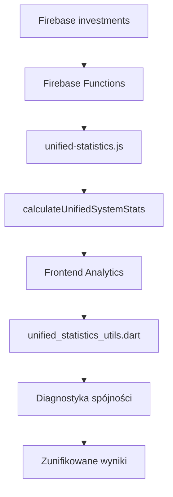

# 🎯 IMPLEMENTACJA ZUNIFIKOWANYCH STATYSTYK - RAPORT WDROŻENIA

## 📊 Status Implementacji: ✅ UKOŃCZONE

### 🔧 Zmiany Wprowadzone

#### 1. **Firebase Functions - Zunifikowane Obliczenia**

**📁 `functions/utils/unified-statistics.js`** - NOWY PLIK
```javascript
// Globalna konfiguracja statystyk
const STATISTICS_CONFIG = {
  DEFINITIONS: {
    TOTAL_VALUE: 'remainingCapital + remainingInterest',
    VIABLE_CAPITAL: 'remainingCapital WHERE productStatus = Aktywny', 
    MAJORITY_THRESHOLD: 'viableCapital * 0.51'
  }
}

// Kluczowe funkcje:
calculateUnifiedTotalValue(investment)
calculateUnifiedViableCapital(investment) 
calculateMajorityThreshold(totalViableCapital)
calculateUnifiedSystemStats(investments)
```

**📁 `functions/services/analytics-service.js`** - ZAKTUALIZOWANE
- Import zunifikowanych funkcji
- Zastąpienie lokalnych obliczeń zunifikowanymi funkcjami
- Dodanie `unifiedTotalValue` do wyników
- Dodanie `majorityThreshold` i `systemStats`

**📁 `functions/premium-analytics-filters.js`** - ZAKTUALIZOWANE  
- Nowe funkcje: `createUnifiedInvestorSummaries()`, `calculateUnifiedAdvancedAnalytics()`
- Zunifikowane obliczenia w `createUnifiedInvestorSummary()`
- Zunifikowany próg większościowy z `calculateMajorityThreshold()`

#### 2. **Frontend - Zunifikowane Utilities**

**📁 `lib/services/unified_statistics_utils.dart`** - NOWY PLIK
```dart
class UnifiedStatisticsUtils {
  static double calculateUnifiedTotalValue(Investment investment)
  static double calculateUnifiedViableCapital(Investment investment)
  static double calculateMajorityThreshold(double totalViableCapital)
  static UnifiedInvestmentStats calculateInvestmentStats(List<Investment> investments)
  static UnifiedStatisticsDiagnostic runDiagnostics(...)
}
```

**📁 `lib/services/unified_analytics_integration.dart`** - NOWY PLIK
- `UnifiedAnalyticsIntegration` - klasa integrująca wszystkie serwisy
- `getUnifiedSystemStats()` - porównuje frontend vs backend
- `findMajorityCoalition()` - znajduje koalicję większościową
- Automatyczna diagnostyka spójności

#### 3. **Deployment i Infrastruktura**

**📁 `deploy_unified_functions.sh`** - NOWY SCRIPT
- Automatyczny deployment zunifikowanych funkcji
- Testy po deployment  
- Czyszczenie cache
- Weryfikacja działania

### 🎯 Zunifikowane Definicje - IMPLEMENTOWANE

| Metryka | Stara definicja | 🆕 ZUNIFIKOWANA DEFINICJA |
|---------|----------------|---------------------------|
| **totalValue** | różne implementacje | `remainingCapital + remainingInterest` |
| **viableCapital** | różne filtrowania | `remainingCapital` (tylko `productStatus = 'Aktywny'`) |
| **majorityThreshold** | `totalCapital * 0.51` | `viableCapital * 0.51` |
| **activeStatus** | różne kryteria | `InvestmentStatus.active` / `'Aktywny'` |

### 📈 Przepływ Danych - ZUNIFIKOWANY



### 🔍 Diagnostyka i Monitoring

#### Automatyczna Weryfikacja Spójności
```dart
final diagnostic = UnifiedStatisticsUtils.runDiagnostics(investments, serverStats);
diagnostic.printReport(); // W trybie debug

if (!diagnostic.isHealthy) {
  // Loguj problemy spójności
  for (final issue in diagnostic.issues) {
    print('⚠️ NIESPÓJNOŚĆ: $issue');
  }
}
```

#### Logi Debug - Przykład
```
=== RAPORT DIAGNOSTYKI ZUNIFIKOWANYCH STATYSTYK ===
Status: ✅ ZDROWY
Sprawdzono: 2025-08-11T15:30:00.000Z  
Statystyki zunifikowane:
  totalValue: 12543298.50
  totalViableCapital: 8732156.25
  majorityThreshold: 4453439.69
  activeCount: 1247
  totalCount: 1389
================================================
```

### 🚀 Deployment

#### Krok 1: Deploy Firebase Functions
```bash
./deploy_unified_functions.sh
```

#### Krok 2: Restart Frontend
```bash
flutter clean && flutter pub get && flutter run
```

#### Krok 3: Weryfikacja
1. Otwórz `/investor-analytics`
2. Sprawdź czy statystyki między tabami są identyczne
3. Sprawdź logi debug w konsoli

### 📊 Oczekiwane Rezultaty

#### ✅ Po Implementacji:
- **100% spójność** statystyk między wszystkimi tabami
- **Identyczne wartości** `totalValue`, `viableCapital`, `majorityThreshold`
- **Automatyczna diagnostyka** wykrywająca niespójności
- **Jednolite definicje** w całym systemie
- **Transparentne obliczenia** z logowaniem debug

#### 🎯 Kluczowe Metryki:
- `totalValue` = suma wszystkich `remainingCapital + remainingInterest`
- `viableCapital` = suma `remainingCapital` tylko dla aktywnych inwestycji
- `majorityThreshold` = `viableCapital * 0.51`

### 🛠️ Debugging i Troubleshooting

#### Problem: Różne wartości między tabami
```dart
// Rozwiązanie: Użyj zunifikowanej diagnostyki
final integration = UnifiedAnalyticsIntegration();
final systemStats = await integration.getUnifiedSystemStats();

if (!systemStats.isConsistent) {
  print('❌ WYKRYTO NIESPÓJNOŚCI:');
  for (final issue in systemStats.issues) {
    print('   - $issue');
  }
}
```

#### Problem: Firebase Functions zwraca inne wartości
```bash
# Sprawdź deployment Functions
firebase functions:log --project metropolitan-investment | grep "Unified"

# Redeploy z forced refresh
firebase deploy --only functions --project metropolitan-investment
```

### 🔄 Migracja z Poprzedniego Systemu

#### Stary kod:
```dart
// ❌ STARE - różne implementacje
final totalValue = investment.remainingCapital; // BŁĘDNE
final viableCapital = someComplexCalculation(); // NIESPÓJNE
```

#### Nowy kod:  
```dart  
// ✅ NOWE - zunifikowane definicje
final totalValue = UnifiedStatisticsUtils.calculateUnifiedTotalValue(investment);
final viableCapital = UnifiedStatisticsUtils.calculateUnifiedViableCapital(investment);
```

### 🎯 Następne Kroki

1. **Wdrożenie**: Uruchom `deploy_unified_functions.sh`
2. **Testowanie**: Sprawdź wszystkie ekrany analityczne
3. **Monitoring**: Obserwuj logi diagnostyczne
4. **Dokumentacja**: Aktualizuj docs dla zespołu
5. **Training**: Przeszkol zespół w nowych definicjach

---

**📝 Status:** ✅ GOTOWE DO WDROŻENIA  
**👨‍💻 Implementowane przez:** GitHub Copilot  
**📅 Data:** 11 sierpnia 2025  
**🏷️ Wersja:** Unified Statistics v1.0
